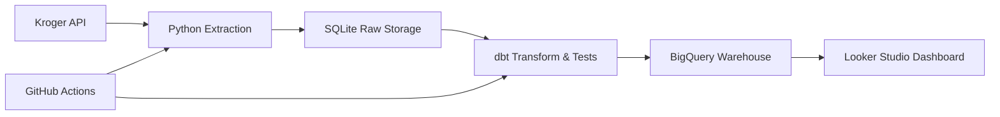

## 🛒 Grocery Product Analytics Pipeline


An end-to-end analytics engineering project that ingests product data from the Kroger API, applies structured transformations and data quality validation with dbt, loads curated models into BigQuery, and delivers business-ready insights through Looker Studio.

This project demonstrates modern data stack principles: modular modeling, automated data validation, cloud warehousing, and CI-driven orchestration.

## 🎯 Project Goal

The goal of this project is to build a production-style analytics pipeline that enables me to visualize and analyze my grocery spending in order to make more financially responsible decisions.

By transforming raw product data into validated, analytics-ready warehouse models, this project allows me to:

- Track grocery spending trends

- Analyze product pricing patterns

- Identify spending habits over time

- Build data-driven budgeting insights

This project bridges personal finance and analytics engineering by applying modern data stack principles to a real-world use case.

## 🛠 Tech Stack

- Python 3.10

- SQLite (raw staging layer)

- dbt (transformation & data quality)

- Google BigQuery (cloud data warehouse)

- GitHub Actions (CI/CD orchestration)

- Looker Studio (analytics & visualization)

## 📂 Project Structure

Below is a high-level overview of the repository organization:

```text
grocery_project/
│
├── pipeline/
│   ├── extract/        # Kroger API ingestion logic
│   ├── transform/      # Data preparation logic
│   └── load/           # BigQuery loading logic
│
├── dbt_project/        # dbt models & schema tests
│   ├── models/
│   └── tests/
│
├── .github/
│   └── workflows/      # GitHub Actions orchestration
│
├── products.db         # Local SQLite raw staging database
├── requirements.txt    # Python dependencies
└── README.md
```

## 🏗 Architecture



## 🚀 Pipeline Workflow

1. Extract raw grocery product data from the Kroger REST API using Python

2. Persist raw ingestion data in SQLite to simulate a staging layer

3. Transform and model data using dbt

4. Apply YAML schema tests to validate data quality

5. Deduplicate product_id values via SQL model

6. Enforce uniqueness constraints using dbt tests

7. Load curated models into BigQuery (products_dataset.products_2)

8. Power analytics dashboards in Looker Studio

9. Orchestrate the full workflow daily using GitHub Actions

## 🧠 Analytics Engineering Approach

- This project follows analytics engineering best practices:

    - Clear separation between raw ingestion and analytics-ready models

    - dbt-driven transformation layer

    - Automated data quality validation

    - Reproducible daily orchestration

    - Warehouse-first modeling mindset

## 🔎 Data Validation Strategy

- YAML schema tests

- Explicit uniqueness validation on product_id

- SQL model to deduplicate source data before warehouse load

- Automated test execution during scheduled runs

## 🔄 Orchestration & Automation

- Fully automated daily pipeline using GitHub Actions

- End-to-end execution including:

    - API extraction

    - Transformation

    - dbt tests

    - Warehouse load

- Designed for repeatability and production-style execution

## 📦 Warehouse Output

BigQuery

- Dataset: products_dataset

- Table: products_2

The final table contains validated, deduplicated, analytics-ready grocery product data suitable for BI consumption.

## 📊 Outcome

This project demonstrates:

- End-to-end data pipeline ownership

- Data modeling discipline using dbt

- Automated data validation workflows

- Cloud warehouse integration

- CI-based orchestration

- Delivery of BI-ready datasets

## 📈 Future Enhancements

- Incremental models for performance optimization

- Warehouse partitioning & clustering

- dditional analytics marts

- Infrastructure as code (Terraform)

- Data freshness monitoring

